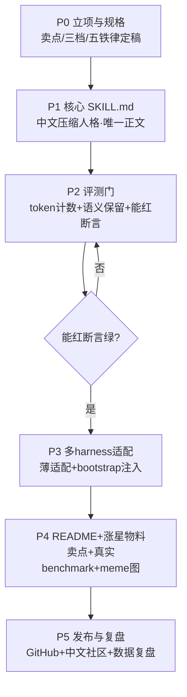
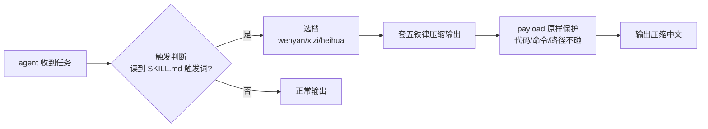

# S1 详细方案 ·「惜字如金」中文版省 token meme skill

> 档位：S 档第 1 个项目（纯 Python/无 Java，练 Agent Loop 入门 + 涨星开路）
> 状态：老大已拍板（文言压缩方向 + 「惜字如金」命名），P0 完成（2026-10-06），P1 进行中
> 对标：caveman（10.9 万星）/ ponytail（15.4 万星）/ superpowers（29.5 万星）

---

## 0. 一句话定位与卖点

**中文版「省 token」meme skill** —— 教 coding agent 用「文言/成语/黑话」说话，把 prompt 的 token 砍掉一大截。

- **一句话卖点（推荐）**：**「惜字如金」** —— 成语自带「省字」梗，字面就是「珍惜字词 = 省 token」，中文独有、英文翻不出，差异化极强。
- **英文 tagline（对标 caveman "why use many token when few token do trick"）**：
  > *"why use many token when one Chinese character do trick"*
- **备选卖点**（供老大拍）：
  | 候选 | 梗点 | 风险 |
  |---|---|---|
  | 「惜字如金」 | 成语自带省字梗，最稳 | 略正经 |
  | 「一字抵千言」 | 文言张力强 | 偏文 |
  | 「省字，是美德」 | 反讽、易转发 | 太隐晦 |

---

## 1. 对标与差异化（凭什么涨星）

| 对标 | 它怎么做的 | 我们怎么超越 |
|---|---|---|
| **caveman** | skill（输出话术）+ Go proxy（输入压缩），ASD-STE100 受控英语，三层俱乐部 | 把「受控英语」换成「**中文文言/成语/术语**」——中文单字表意 + 四字成语是天然压缩基因，caveman 的英文做不到 |
| **ponytail** | 人格化 YAGNI skill + **诚实 benchmark**（主动纠正夸大） | 学它最值钱的一条：**诚实 benchmark + 能红断言 + 阴性对照** |
| **superpowers** | 唯一正文 SKILL.md + 多 harness 薄适配 + bootstrap 注入 | 学它的「一次编写、多 harness 通用」结构 |

**核心差异化 = 中文空位**：caveman/ponytail 全是英文 meme，中文 agent 生态（豆包/Kimi/Qwen/DeepSeek）里没有对应的「中文省 token skill」。

---

## 2. 核心机制（中文压缩方法学）

### 2.1 五条铁律（对标 caveman 的 ASD-STE100，做中文受控压缩法「惜字法」）

| # | 铁律 | 规则 | 示例 |
|---|---|---|---|
| 1 | **一字一意** | 双字词压单字 | 现在→今 / 但是→然 / 因为→因 |
| 2 | **成语压缩** | 长句压四字成语 | 「重新渲染的原因是 prop 引用了新对象」→「引用新对象，故重渲染」 |
| 3 | **意义不丢** | 数字、单位、专名、否定词**绝不压缩** | 「不」「非」「禁止」原样保留 |
| 4 | **payload 原样** | 代码/命令/路径/URL 逐字符保留 | 任何 `code`、`/usr/bin/...`、`https://` 不碰 |
| 5 | **工具静默** | 工具调用参数不压缩 | function call 的 JSON schema 原样 |

### 2.2 三层压缩档（对标 caveman 的 /caveman /ultracave /megacave）

| 档 | 命令 | 风格 | 压缩率 | 对标 |
|---|---|---|---|---|
| 文言档 | `/wenyan` | 文言文（之乎者也 + 单字） | 中 | /caveman |
| 惜字档 | `/xizi` | 成语 + 极限单字 | 高 | /ultracave |
| 黑话档 | `/heihua` | A 股/垂直术语缩写 | 最高（领域化） | /megacave |

**示例（对标 caveman 的 React 重渲染例）**：
- 原句：`你的 React 组件在重新渲染，原因是每次渲染都创建了新的对象引用，导致 props 变化。`
- `/wenyan`：`每渲染新对象引用，故重渲染。useMemo 包之。`
- `/xizi`：`新引用，故重渲染。useMemo。`
- `/heihua`（A 股版）：`量比放大、龙虎榜异动，追涨需谨慎。`

---

## 3. 完整开发路线（6 个 Phase 总览）

> 原则：**需求 → 规格 → 实现 → 亲验 → 复盘**，不做「需求直接落地」。每个 Phase 有明确产出物 + 验收判据。

| Phase | 名称 | 产出物 | 验收判据 |
|---|---|---|---|
| **P0** | 立项与规格 | 本方案 + README 骨架 + 目录结构 + LICENSE | 卖点/三档/五铁律定稿，目录就位 |
| **P1** | 核心 SKILL.md | `SKILL.md`（中文压缩人格，唯一正文） | 五铁律 + 三档示例完整、可直接装 |
| **P2** | 评测门 | `eval/` 源码（计数器/基准/语义评测 + golden 集） | 能红断言绿，拿到真实压缩率数字 |
| **P3** | 多 harness 适配 | `adapters/` + `hooks/`（bootstrap 注入） | 至少 2 个 harness 亲验装上并触发 |
| **P4** | README + 涨星物料 | 完整 README + logo meme 图 + 首发文案 | README「一次读完、读完想转发」 |
| **P5** | 发布与复盘 | GitHub 仓库 + 中文社区发帖 + 数据复盘 | 已发布，star 曲线进入观察 |

---

## 4. 详细制作路径（每 Phase 步骤 + 验收）

### P0 立项与规格（半天）
1. 拍板一句话卖点 + 项目名（见 §9 待拍）。
2. 定稿五铁律 + 三层压缩档（本方案 §2）。
3. 建目录结构（§6）+ `LICENSE`（MIT，对标 caveman/ponytail）。
4. 写 README 骨架（只放卖点 + 目录，内容 P4 再补全）。
- **验收**：目录结构照 §6 就位；卖点/三档/五铁律有文字记录。

### P1 核心 SKILL.md（1 天）
1. 写 `SKILL.md`：frontmatter（name/description/触发词）+ 正文（五铁律 + 三档 + 示例）。
2. 描述写清「何时该用」——让 agent 自己判断是否触发（学 superpowers 的自动触发）。
3. 配 6 组 before/after 示例（技术问答 + 代码解释 + 报错排查各 2 组）。
- **验收**：任一 harness 里手动贴入 SKILL.md，agent 能按 `/xizi` 输出压缩后的中文。

### P2 评测门（1-2 天）★ 本项目灵魂
1. `eval/token_counter.py`：用 tiktoken（o200k，对标 caveman 同口径）计数。
2. `eval/compress_bench.py`：跑 golden 集，算「压缩率 = 压缩后 token / 原 token」。
3. `eval/semantic_eval.py`：LLM-as-judge 或答对率，验证「压缩不丢意义」。
4. `eval/datasets/golden_zh.jsonl`：≥50 条中文技术问答（React/Python/SQL/A股 各分）。
5. **能红断言**：`压缩率 ≤ 0.75`（即省 ≥25%）；**阴性对照**：不压缩 vs 压缩，答对率无显著下降。
- **验收**：`python -m eval.compress_bench` 一键出真实数字；断言绿；数字写进 README（学 ponytail 诚实 benchmark）。

### P3 多 harness 适配（1 天）
1. `adapters/claude-code/`、`adapters/codex/`、`adapters/opencode/` 各一个薄适配。
2. `hooks/` session-start 注入 bootstrap（学 superpowers）。
3. 安装脚本（Shell，学 superpowers 的 install 脚本）。
- **验收**：至少 2 个 harness 亲验装上、重启后 SKILL.md 自动可触发。

### P4 README + 涨星物料（1 天）
1. 完整 README：一句话卖点 → 三层示例（before/after）→ 真实 benchmark 数字 → 安装 → 诚实边界。
2. logo meme 图（文言风/印章风，学 caveman 的 rock logo）。
3. 首发文案（即刻/X/掘金/V2EX 四套）。
- **验收**：README 拿给外人「一次读完、读完想转发」；数字是 P2 真实数字，非自述。

### P5 发布与复盘（半天 + 持续）
1. 建 GitHub 仓库（`@qlheric/` 署名），推代码。
2. 首发中文社区 + GitHub Trending 观察。
3. 复盘 star 曲线，登记进超级大脑（记录即真相）。
- **验收**：仓库可 clone、可装、可跑评测；复盘登记完成。

---

## 5. 总流程图



**压缩机制子流程**（SKILL.md 运行时怎么工作）：



---

## 6. 目录结构（改功能走源码，不写临时脚本）

```
s1-惜字如金-中文省token/
├── README.md                 # 卖点 + benchmark + 三档示例 + 安装
├── SKILL.md                  # ★ 核心正文（唯一真相源：五铁律+三档+示例）
├── LICENSE                   # MIT
├── eval/                     # ★ 评测源码（正式模块，不是 tmp_*.py 脚本）
│   ├── __init__.py
│   ├── token_counter.py      # token 计数（tiktoken o200k）
│   ├── compress_bench.py     # 压缩率基准（一键出真实数字）
│   ├── semantic_eval.py      # 语义保留评测（答对率/LLM-judge）
│   └── datasets/
│       └── golden_zh.jsonl   # golden 中文问答集（≥50 条）
├── adapters/                 # 多 harness 薄适配（学 superpowers）
│   ├── claude-code/
│   ├── codex/
│   └── opencode/
├── hooks/                    # session-start 注入 bootstrap
├── install.sh                # 安装脚本
└── docs/
    └── 00-S1-详细方案.md     # 本方案
```

**「改源码不写脚本」纪律**：加任何新功能（新压缩档、新评测指标、新适配）→ 直接改 `SKILL.md` 或 `eval/*.py` / `adapters/*` 对应源码文件，**禁止**堆 `tmp_*.py` / `fix_*.sh` 这类一次性脚本；一次性脚本用完后要么并入源码、要么删。

---

## 7. 评测设计（诚实 benchmark + 能红断言 + 阴性对照）

| 评测 | 做法 | 判据 |
|---|---|---|
| **压缩率** | tiktoken o200k 数 token，压缩后/原 | 省 ≥25%（目标 30-50%） |
| **语义保留** | golden 50 条，压缩前后答对率对比 | 答对率无显著下降（≤5% 波动） |
| **能红断言** | `compress_bench` 断言「压缩率 ≤0.75」 | 失败则门红，不发布 |
| **阴性对照** | 不压缩 vs 压缩同题跑一遍 | 证明「省 token 不以丢意义为代价」 |

**诚实纪律（学 ponytail）**：README 里主动写明「压缩率是 50 条 golden 集实测，不是全场景天花板」；若早期数字夸大，主动纠正——这份诚实反而更可信、更涨星。

---

## 8. 涨星打法与首发渠道

- **一句话卖点 + meme 图**：学 caveman（rock logo）→ 我们做「印章/文言」风 logo。
- **首发中文社区**：即刻 → X → 掘金 → V2EX，蹭「中文 agent 生态」热度。
- **放大器**：被大 V/社区转发 = 涨星爆发；备选「第三方引用」（如被某个中文 agent 教程引用）。
- **诚实 benchmark 反向加分**：主动纠正夸大，学 ponytail。
- **绑定大故事**：它只是「省 token 小工具」，但可挂进「点将台 = 给老板的 AI 员工 OS」大盘子（省 token 是其中一环），为后续 M 档引流。

---

## 9. 待拍决策（单条）

> **要拍什么**：S1 的「一句话卖点 + 项目名」是否照我的推荐定？
> **我的推荐**：项目名 **「惜字如金」**（英文 repo 名 `xizi-rujin`），一句话卖点就用成语本身「惜字如金」+ 英文 tagline *"why use many token when one Chinese character do trick"*。
> **代价**：定名后 logo、README、首发文案都围绕它做，改名成本小（几处文字）。
> **错了会怎样**：改名只改几处文字，不影响技术实现；真正不可逆的是 P5 发布后的 repo 名。

（若卖点有别的想法，这条改完即可开工；其余设计——三档/五铁律/目录/评测——我已给全推荐，你看完方案确认即可，不必逐条问我。）
